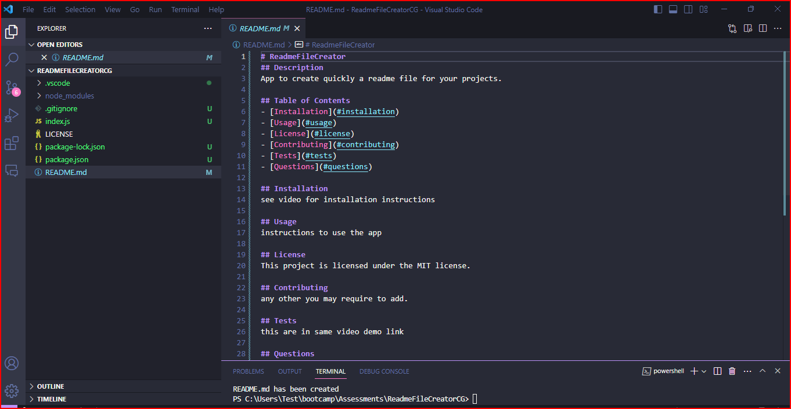

# ReadmeFileCreator

## Description

Application made with node js for quick and fast readme file generation from vs code terminal.

## User Story

AS A developer
I WANT to create a reademe file in a very quick and easy way from my vs terminal
SO THAT I can have information of my app.

## Table of Contents

- [Installation](#installation)
- [Usage](#usage)
- [License](#license)
- [Contributing](#contributing)
- [Tests](#tests)
- [Questions](#questions)

## Installation

please see demo in https://drive.google.com/file/d/1EkRso7-H1-tqJLaJ6WfZQQ-NX2Yed-2H/view?usp=sharing

## Usage

For developers

## License

This project is licensed under the MIT license.

## Contributing

N/A

## Tests

please see demo in https://drive.google.com/file/d/1EkRso7-H1-tqJLaJ6WfZQQ-NX2Yed-2H/view?usp=sharing

## Mock-Up

The following image shows the web application's appearance and functionality:

.

## App Link

https://github.com/Camila-Maria-Pilar/ReadmeFileCreatorCG

## Questions

For any questions, please contact me with the information below:

GitHub: [@Camila-Maria-Pilar](https://github.com/Camila-Maria-Pilar)
Email: camila.m.galleguillos@gmail.com
